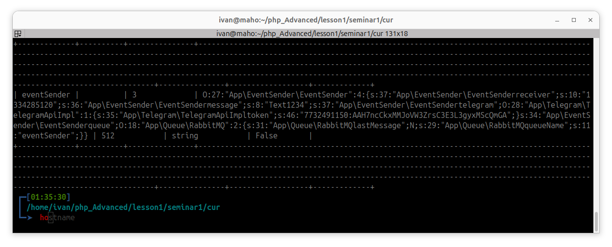
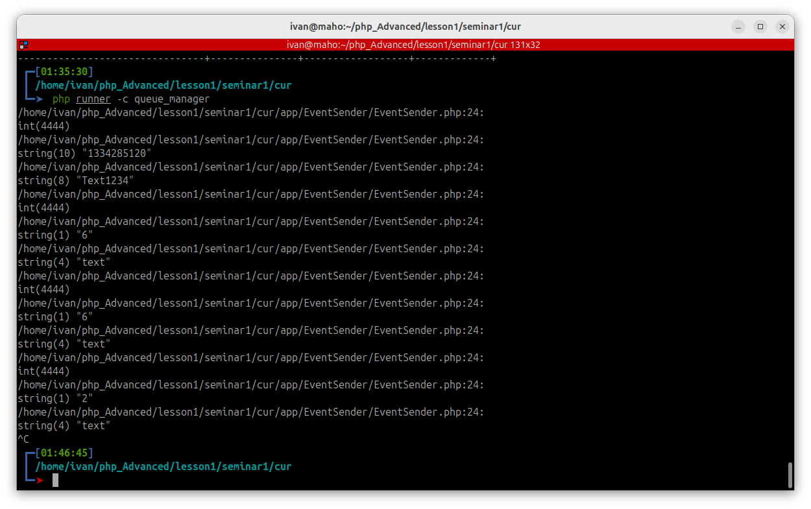

# reminger-tg-bot
docker run --rm -v ${pwd}/:/cli php:8.2-cli php /cli/vendor/phpunit/phpunit/phpunit cli/tests


### Содержимое crontab

* * * * * /home/ivan/php_Advanced/lesson1/seminar1/cur/echo_date

## REDIS

```bash
127.0.0.1:6379> PFADD hll_key2 element21 element22 element23
(integer) 1
127.0.0.1:6379> PFADD hll_key1 element11 element12 element13
(integer) 1
127.0.0.1:6379> PFCOUNT hll_key1
(integer) 3
127.0.0.1:6379> PFCOUNT hll_key2
(integer) 3
127.0.0.1:6379> PFMERGE hll_key_merge2 hll_key1 hll_key2
OK
127.0.0.1:6379> PFCOUNT hll_key_merge2
(integer) 6
127.0.0.1:6379> SET my_key "Hello, Redis"
OK
127.0.0.1:6379> GET my_key
"Hello, Redis"
127.0.0.1:6379> 
127.0.0.1:6379> SET my_key "Hello, Redis"
OK
127.0.0.1:6379> EXPIRE my_key 10
(integer) 1
127.0.0.1:6379> EXISTS my_key
(integer) 1
127.0.0.1:6379> EXISTS my_key
(integer) 1
127.0.0.1:6379> EXISTS my_key
(integer) 0
127.0.0.1:6379> 
127.0.0.1:6379> SET counter 100
OK
127.0.0.1:6379> INCR counter
(integer) 101
127.0.0.1:6379> DECR counter

 ┏━[02:25:22]  
 ┃ /home/ivan/php_Advanced/lesson1/seminar1/cur
 ┗━➤  php runner -c tg_messages
[]]]]]%                                                                                              ┏━[02:26:03]  
 ┃ /home/ivan/php_Advanced/lesson1/seminar1/cur
 ┗━➤  redis-cli
127.0.0.1:6379> KEYS *
 1) "hll_key"
 2) "tg_messages:offset"
 3) "hll_key2"
 4) "my_hash"
 5) "hll_key1"
 6) "counter"
 7) "my_bit"
 8) "my_set2"
 9) "hll_key_merge2"
10) "my_set1"
11) "tg_messages:old_messages"
127.0.0.1:6379> 


```

## RabbitMQ

```bash
sudo apt install rabbitmq-server                 //installation

sudo rabbitmq-plugins enable rabbitmq_management //plagin install

rabbitmqadmin declare exchange name=my_fanout_exchange type=fanout // fanout creating

rabbitmqadmin declare queue name=my_queue_1      //creating queue 1

rabbitmqadmin declare queue name=my_queue_2      //creating queue 2

rabbitmqadmin declare binding source=my_fanout_exchange destination=my_queue_1 destination_type=queue                           //binding queue1 and fanout

rabbitmqadmin declare binding source=my_fanout_exchange destination=my_queue_2 destination_type=queue                           //binding queue1 and fanout

rabbitmqadmin publish exchange=my_fanout_exchange routing_key="" payload="Hello, World"


rabbitmqadmin get queue=my_queue_1 // get queue1

php runner -c queue_manager 
```





